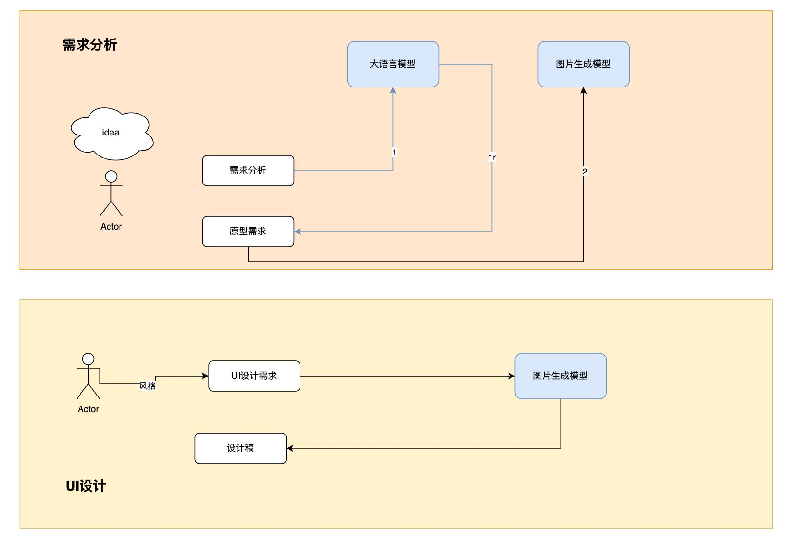
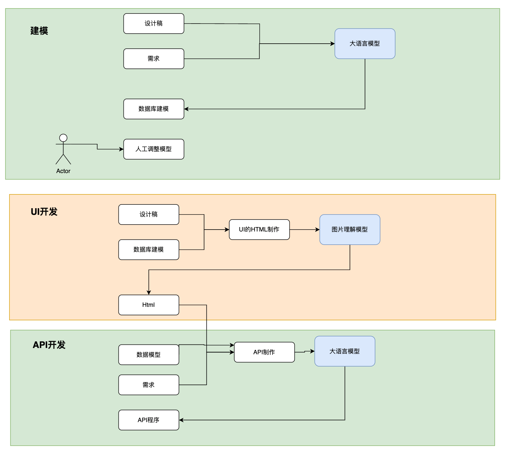
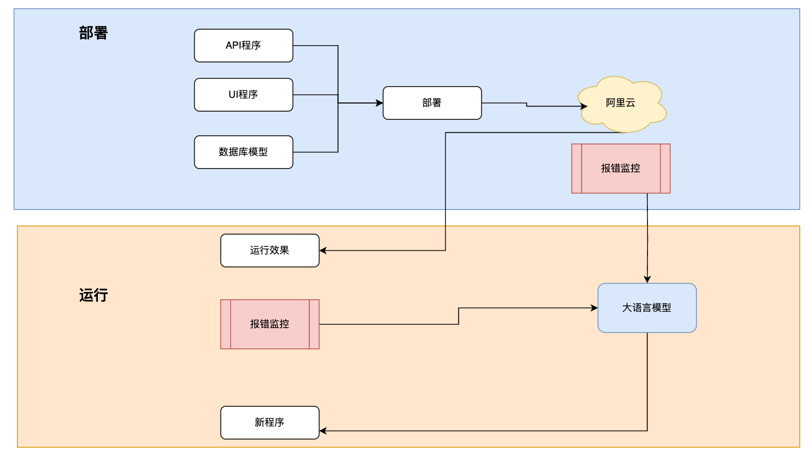

# autodev

#### Introduction
Automated coding through AI
## Orchestrating various large models into specific development processes

- Autodev automatically completes the following tasks:

- Requirement analysis

- UI design

- Database modeling

- UI development

- API development

- Deployment

- Run & debug

- Bug fix & run

## Overall architecture

